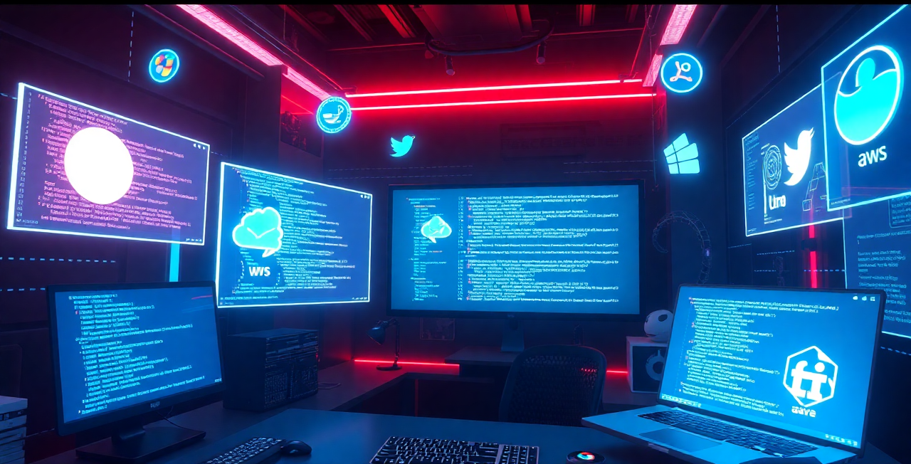

<!-- 

  

<h1 align="center">Hi👋, I am Naimur Rahman Rumel </h1>

<h2>
 I am currently a <b>Trainee Software Engineer</b> at
  <a herf="https://www.linkedin.com/company/onnorokom-projukti-limited/posts/?feedView=all"><b>OnnoRokom Projukti Limited</b></a>
</h2>

  Besides, I am currently serving as the President of <strong> Noakhali Association, SUST </strong> , the General Secretary of <strong> Fusion Students Association </strong> , and the Convenor of <strong> Bangladesh Youth Council. </strong>  Additionally, I hold the position of Publication Secretary at <strong> Sher-E-Bangla Youth Society </strong> and work as a Campus Ambassador for Campus News. Previously, I served as the General Secretary of Ongikar Cultural Organization,

 -->

<!DOCTYPE html>
<html lang="en">
<head>
  <meta charset="UTF-8">
  <meta name="viewport" content="width=device-width, initial-scale=1.0">
  
</head>
<body >
  

  

<h1 align="center">Hi👋, I am Naimur Rahman Rumel </h1>

<h2 align="center"  class="feature">
 I am currently a <b>Trainee Software Engineer</b> at
  <a herf="https://www.linkedin.com/company/onnorokom-projukti-limited/posts/?feedView=all"><b>OnnoRokom Projukti Limited</b></a>
</h2>

  Besides, I am currently serving as the President of <strong> Noakhali Association, SUST </strong> , the General Secretary of <strong> Fusion Students Association </strong> , and the Convenor of <strong> Bangladesh Youth Council. </strong>  Additionally, I hold the position of Publication Secretary at <strong> Sher-E-Bangla Youth Society </strong> and work as a Campus Ambassador for Campus News. Previously, I served as the General Secretary of Ongikar Cultural Organization,

</body>
</html>
